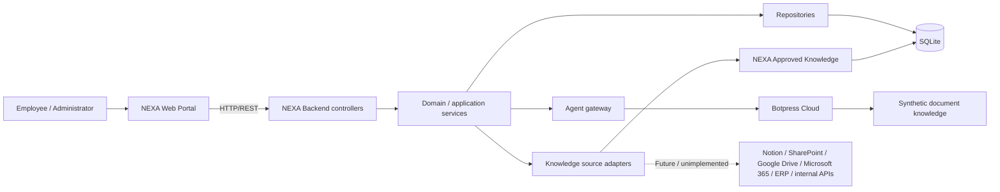

# Architecture Goals

Deliver a simple MVP with clear domain boundaries, separate frontend/backend work, replaceable Botpress and source integrations, and mandatory human approval. Shared provisional contracts allow four developers and Codex agents to work independently without unrelated refactors. This is a plan; no application or integration exists by virtue of this document.

# System Context

Employee/admin modes use the NEXA Web Portal. Only the NEXA Backend exposes business operations: its services use persistence, an agent gateway, and source adapters. Botpress Cloud initially supplies agent orchestration and may retrieve the configured synthetic document source. Persistence and adapters are service dependencies, not a mandatory sequential pipeline.



# Planned Repository Structure

```text
apps/
  web/
  api/
packages/
  shared/
knowledge/
  documents/
  test-questions/
docs/
infra/
  docker/
.github/
  workflows/
AGENTS.md
README.md
.env.example
```

- `apps/web/`: screens, UI components, and backend client.
- `apps/api/`: HTTP handlers, domain workflows, repositories, and adapters.
- `packages/shared/`: provider-neutral DTOs and lifecycle values agreed in `API_CONTRACTS.md`.
- `knowledge/documents/`: synthetic seed documents; `knowledge/test-questions/`: documented and intentionally undocumented demo questions.
- `docs/`: product, requirements, architecture, contracts, demo, and decisions.
- `infra/docker/`: reserved for deferred optional Compose configuration; not required initially.
- `.github/workflows/`: future verification automation once commands exist.
- `AGENTS.md`: contribution instructions; `README.md`: future setup/run guidance; `.env.example`: future placeholder-only configuration names.

This tree specifies intended responsibilities, not authorization to create these paths now.

# Frontend Architecture

React + strict TypeScript + Vite, with Tailwind CSS + shadcn/ui. Screens: `/dashboard`, `/assistant`, `/sources`, `/analytics`, `/knowledge-health`, `/knowledge-operations`.

Components handle presentation and user input. Backend services own classification persistence, deduplication, transitions, approval rules, and metrics. The frontend communicates only with NEXA's API and can initially use explicitly labeled mocks matching its contracts. Employee/admin navigation is not authentication or access control.

# Backend Architecture

Use Node.js + Express + strict TypeScript with pragmatic layers:

| Layer | Responsibility |
| --- | --- |
| Routes/controllers | Validate requests, map HTTP responses, invoke services. |
| Application/services | Coordinate queries, recovery, approvals, publication, and analytics. |
| Domain | Lifecycle/prerequisite rules and provider-neutral entities. |
| Repositories | SQLite reads/writes and related-write transactions. |
| Integrations/adapters | Translate agent/source requests and responses; contain external credentials. |

Do not add microservices or a generalized workflow engine. Backend owns query logging, analytics, gap deduplication/lifecycle, recovery and approval workflows, and source/agent boundaries. Dashboard, Analytics, and Knowledge Health reuse shared aggregation logic. LEARN means reusable knowledge and updated indicators, not model training.

# Persistence

SQLite is sufficient for the MVP. No SQL or ORM choice is prescribed here.

- **Query:** question, answer/outcome, category, source references, optional gap link, timestamp. Provider outages are errors, not evidence-insufficiency outcomes.
- **KnowledgeGap:** id, original question, deterministic normalizedQuestionKey, separate AI-generated display title, category, status, priority, occurrences, evidenceRevision, suggested department/experts, timestamps, and associated actions, information, draft, and approvals.
- **SuggestedAction:** type, description, simulation/approval record. Suggestions do not execute themselves.
- **CollectedInformation:** text, stated origin, collection timestamp, gap link.
- **KnowledgeDraft:** title, content, revision, evidenceRevision used to produce it, gap link, and published article id/revision when successful.
- **ApprovedKnowledgeArticle:** stable article id, article revision, title, content, originating gap/draft revision, and publication timestamp. Stored in the backend-owned NEXA Approved Knowledge store in SQLite; source metadata alone is not article identity.
- **Approval:** decision, draft revision, optional comment, timestamp. It records a demo human interaction, not verified identity.
- **KnowledgeSource:** display metadata and actual integration state; unavailable future sources remain not configured.

Use query-to-gap links plus a gap occurrence counter; no separate occurrence table unless implementation demonstrates a concrete need. Create a gap only for organizationally relevant INSUFFICIENT assessments after successful retrieval. Greetings, unrelated questions, provider failures, and source failures never create gaps.

Compute normalizedQuestionKey deterministically: lowercase, trim, replace punctuation with spaces, and collapse whitespace. A small explicit demo alias map can map equivalent normalized questions to a canonical key. AI-generated display titles and categories never determine identity. Match only non-RESOLVED gaps. Persist each accepted unanswered query, link/create its gap, and increment occurrences exactly once in one transaction (new gaps start at 1). No embeddings, vector thresholds, or confidence percentages are needed for matching. Suggested arrays can remain embedded; do not over-normalize.

# AI / Agent Integration Boundary

An `AgentProvider` / `AgentGateway` exposes two conceptual operations:

| Operation | Provider-neutral contract |
| --- | --- |
| assessQuestion() | Accept question and backend-retrieved approved evidence; consult configured agent knowledge as needed. Return organizational relevance, status SUFFICIENT / INSUFFICIENT / FAILURE, retrieval completion, grounded answer when sufficient, evidence/source references, and suggested category, department, experts/roles, and recovery actions when insufficient. Optional recommendation explanations cite evidence, not hidden chain-of-thought. |
| generateKnowledgeDraft() | Accept collected information and its evidence revision; return draft title/content or a structured failure. Backend assigns saved draft revisions and verifies the evidence revision has not changed. |

Prefer one structured assessment call over separate calls for classification and suggestions. Botpress-specific payloads stay inside the Botpress adapter. FAILURE never creates a gap. A non-relevant result cannot authorize gap creation regardless of sufficiency status. Exact shared conceptual result fields are in `API_CONTRACTS.md`.

Validate external responses before use. Suggestions are tentative and source-supported; unknown experts remain unknown. Backend owns eligibility, matching, counts, persistence, transitions, freshness, approvals, publication, and metrics. If no usable recovery action is returned, provide a deterministic REQUEST_INFORMATION proposal for human approval. Backend development uses FakeAgentProvider while the real Botpress adapter is built; neither adapter can write domain state or authorize publication.

# Knowledge Sources

At least one synthetic document/PDF source must actually work, through Botpress or another explicitly implemented adapter. Notion, SharePoint, Google Drive, Microsoft 365, and ERP/internal APIs are future, replaceable integrations.

MVP publication writes to the backend-owned NEXA Approved Knowledge store in SQLite. The query service reads approved articles immediately and supplies relevant content and article/revision references to assessQuestion(), alongside configured external/agent knowledge. Start with deterministic canonical-question/alias lookup for recovered demo topics and simple text matching where needed; do not build a vector system. Availability to retrieval does not force the AI to declare unrelated evidence sufficient.

PUBLISHED requires a committed approved article revision accessible to this query path. No Botpress indexing, Notion, SharePoint, or external publication is involved. External publication remains a future replaceable adapter. Sources is read-only in the initial MVP and includes the local approved store with honest availability metadata.

# Human-in-the-loop

| State | Meaning / prerequisite |
| --- | --- |
| DETECTED | Gap created. |
| TRIAGED | Human reviewed/classified the gap; narrow triage updates do not themselves change state. |
| ACTION_PROPOSED | At least one usable recovery proposal exists, including the deterministic fallback when needed. |
| IN_PROGRESS | A human-approved recovery action is being followed (simulated externally). |
| KNOWLEDGE_COLLECTED | New information/evidence is recorded. |
| AWAITING_APPROVAL | A current, fresh draft revision awaits human review. |
| PUBLISHED | Approved current article revision is immediately available to NEXA retrieval. |
| RESOLVED | Administrator explicitly closed the gap after publication. |

Retain the exact sequence without requiring a screen per state. Every evidence addition increments gap evidenceRevision. A draft records its input evidenceRevision; if evidence changes, the old draft is stale. Require a new draft revision before review/approval. Evidence is editable only in the collection states defined by the API, not while under review. CHANGES_REQUESTED and REJECTED return to KNOWLEDGE_COLLECTED and prohibit unchanged resubmission: a newer draft revision is mandatory. Rejection rejects the draft, not the gap.

APPROVED authorizes only the current draft revision; successful publication then enters PUBLISHED. Only PUBLISHED can become RESOLVED. CHANGES_REQUESTED or REJECTED returns to KNOWLEDGE_COLLECTED for revision and fresh review. No additional lifecycle statuses are introduced. Generic transitions cannot bypass approval. Emails, meetings, document requests, documentation tasks, publication, and critical external changes require human approval; external recovery execution is simulated in this MVP.

# Error and Fallback Behavior

| Condition | Behavior |
| --- | --- |
| AI unavailable | Explain temporary failure and allow deliberate retry; do not invent an answer or gap. |
| Source unavailable | Report availability failure; do not mistake inaccessible evidence for absent knowledge. |
| Insufficient evidence | Return explicit insufficiency and persist/link the relevant gap. |
| Malformed external response | Reject it with a controlled provider error; do not persist fabricated domain results. |
| Persistence failure | Report failure, roll back related writes, and do not claim saved results or state changes. |

Approve/publish in one local SQLite transaction: validate current fresh draft, persist approval, create/update the published article revision, and set PUBLISHED. Failure rolls back all these writes and leaves AWAITING_APPROVAL; it does not retain a partial approval. Repeating a successfully committed approval for the same draft/revision returns the existing result, including after resolution, without duplicate articles or state regression. Resolution is a separate explicit human action. Demo fallback fixtures/recordings are visibly labeled, never silently substituted for live success.

# Four-Person Workstreams

| Workstream | Ownership |
| --- | --- |
| Frontend | Six screens, mocked HTTP DTOs, forms, review controls, loading/error states; no dependency on Botpress completion. |
| Backend/domain | SQLite, lifecycle, matching, approval/publication, shared analytics aggregation, REST; FakeAgentProvider permits independent progress. |
| AI/Botpress | Configured-source retrieval, structured assessment, evidence-aware suggestions, drafting, provider adapter translation; consume backend-approved evidence through the same neutral contract. |
| Knowledge/demo/QA | Synthetic documents, canonical questions/aliases, expected outcomes, fixtures, reset and fallback procedures. |

Coordinate shared DTO changes through one designated contract owner; use matching fixtures across workstreams. No extra runtime services are required.

# Development / Deployment Direction

Start locally without Docker. Document setup and relevant lint/test/build commands when implemented. Docker Compose may be added after frontend/backend integration is stable for reproducibility; Botpress stays cloud-hosted. No Kubernetes or production infrastructure is required. Shared contracts and focused GitHub branches support independent team work.

# Security Boundaries

Use environment variables and never commit secrets. Only synthetic/non-confidential data enters the prototype. Backend controls integrations and credentials; do not expose them to the frontend. There is no MVP authentication/authorization, so this design is a local/demo system and does not claim production access protection.
